# 🌐 AWS EC2 Static Website Deployment

This project demonstrates how to deploy a simple static website using **Amazon EC2**, hosted inside a **custom VPC**. You'll manually set up your network architecture, configure a web server, and host an HTML/CSS site with Apache on Amazon Linux.

🧠 **Lessons Learned**

- VPC and subnet architecture
- SSH key setup and EC2 access
- Hosting static sites with Apache
- Basic network and security configuration in AWS

---

## 📸 Preview

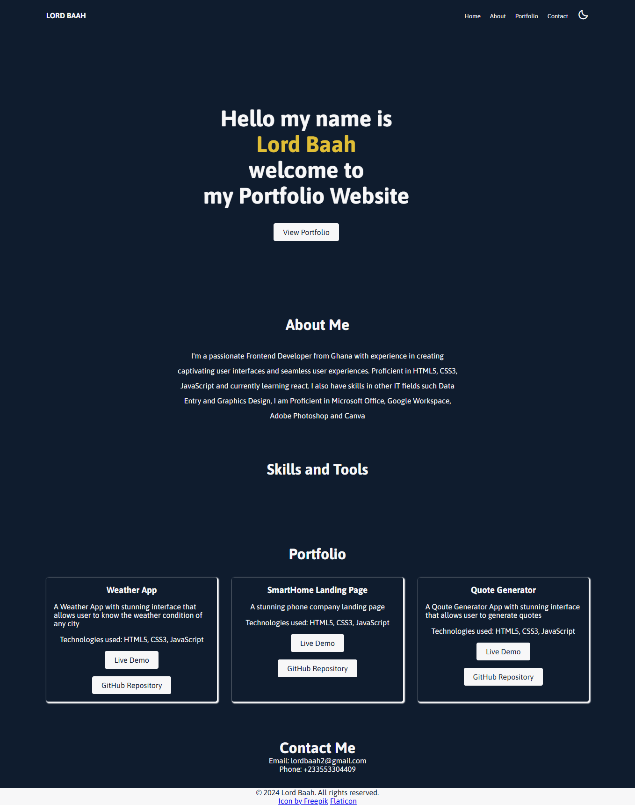

---

## 🗺️ Project Architecture

- **VPC** with public subnet
- **Internet Gateway** and **Route Table** for internet access
- **EC2 Instance** with Apache web server
- **Security Group** allowing HTTP and SSH traffic

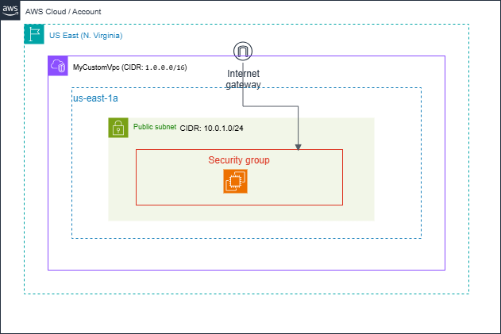

---

## 🛠️ Deployment Steps

### ✅ 1. Create a VPC

- Go to **VPC Console** → Create a VPC
- Name: `MyCustomVpc`
- IPv4 CIDR: `1.0.0.0/16`


---

### ✅ 2. Create a Public Subnet

- Name: `PublicSubnet`
- CIDR Block: `1.0.1.0/24`
- Associate with `MyCustomVpc`
- Enable: `Auto-assign public IP`

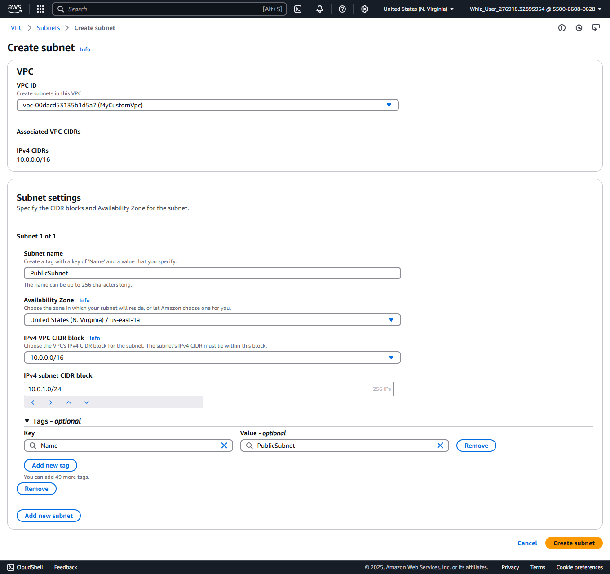
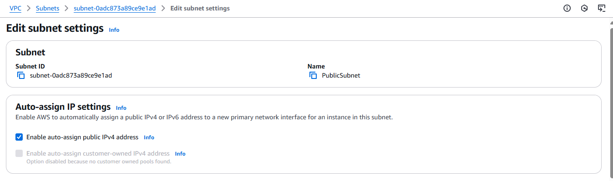

---

### ✅ 3. Attach an Internet Gateway

- Create an **Internet Gateway**
- Attach it to `MyCustomVpc`

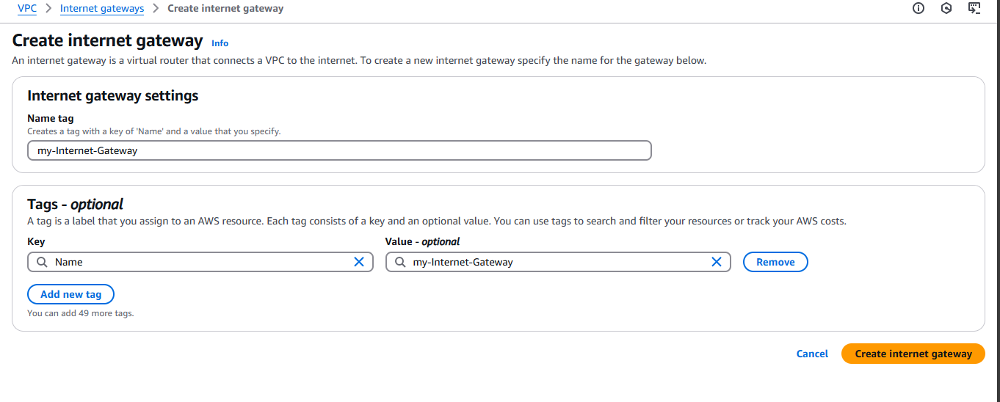
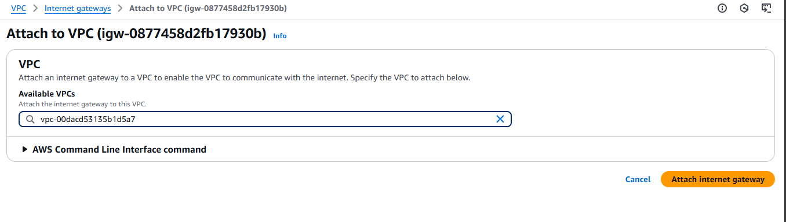

---

### ✅ 4. Create a Route Table

- Create a **Route Table** in the VPC

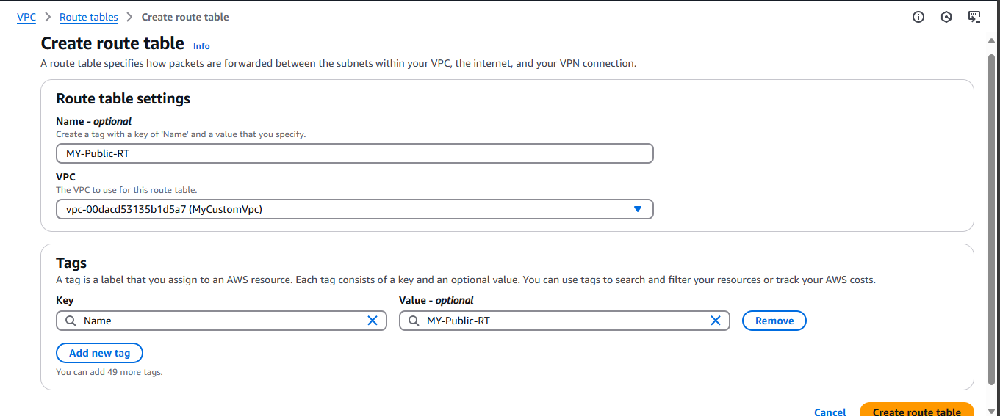

- Add route: `0.0.0.0/0` → Internet Gateway

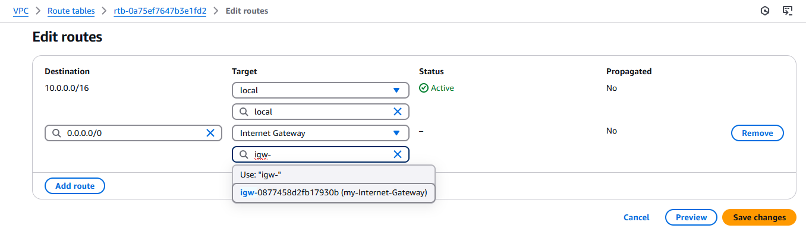

- Associate the **Public Subnet** with this Route Table

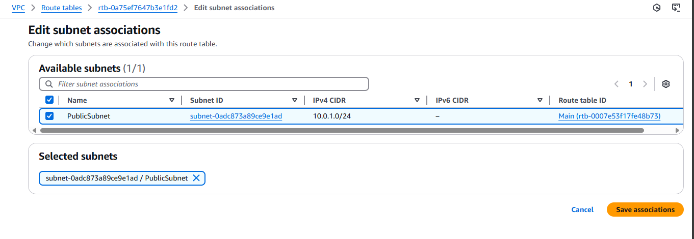

---

### ✅ 5. Create a Security Group

- Name: `WebServerSG`
- Inbound Rules:
  - HTTP (80) — Anywhere (`0.0.0.0/0`)
  - SSH (22) — Anywhere (`0.0.0.0/0`)
- Outbound: Allow all traffic (default)

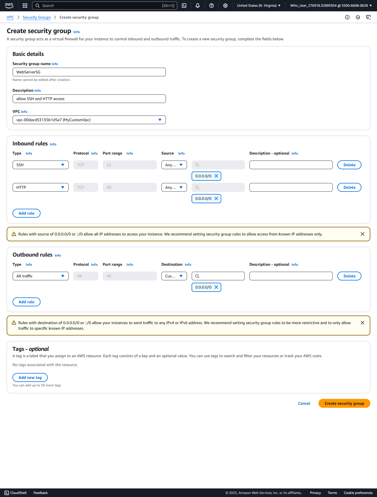

---

### ✅ 6. Launch EC2 Instance

- Go to **EC2 Console** → Launch Instance
- AMI: **Amazon Linux 2023**
- Instance type: `t2.micro` (Free Tier)
- Key Pair: Create or use an existing `.pem` key
- Network Settings:
  - VPC: `MyCustomVpc`
  - Subnet: `PublicSubnet`
  - Security Group: `WebServerSG`
- Launch the instance

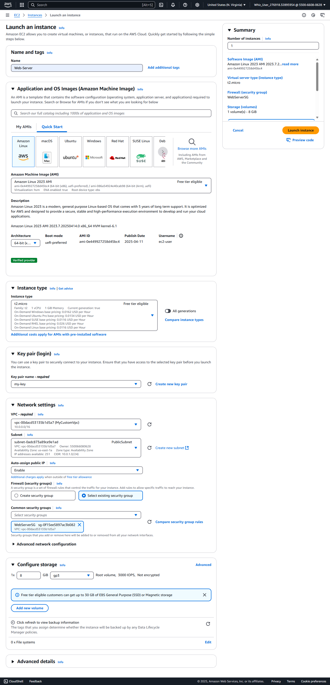

---

### ✅ 7. Connect to EC2 via SSH

Move your key to a secure location (e.g. `Downloads`), then run:

```bash
chmod 400 your-key-name.pem
ssh -i your-key-name.pem ec2-user@<your-ec2-public-ip>
```

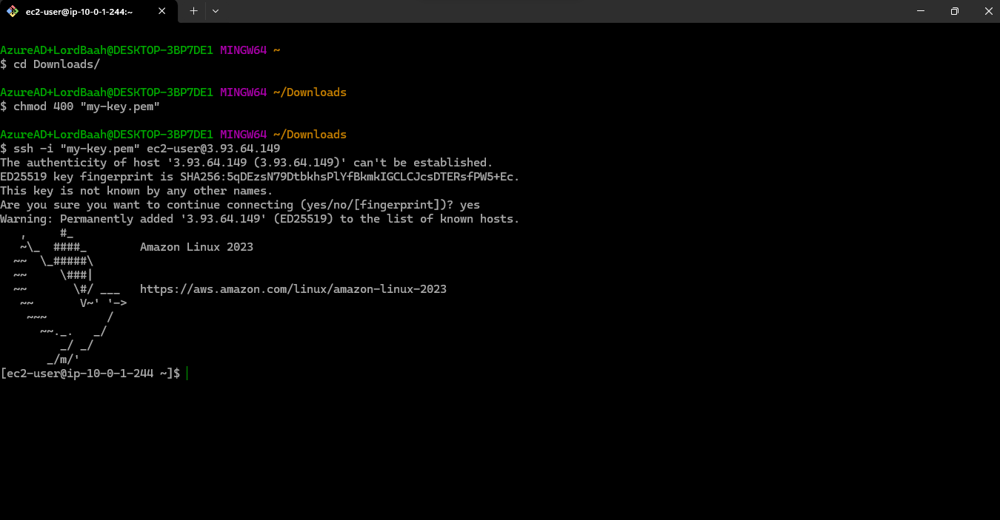

---

### ✅ 8. Install Apache & Deploy Website

```bash
# Update and install Apache
sudo yum update -y
sudo yum install httpd -y

# Start and enable Apache
sudo systemctl start httpd
sudo systemctl enable httpd

# Navigate to Apache root directory
cd /var/www/html

# Create project folder
sudo mkdir mywebsite
cd mywebsite

# Create your website files
sudo nano index.html  # Paste HTML code
sudo nano style.css   # Paste CSS code
sudo nano script.js   # Paste JS code (optional)

# Set permissions
sudo chown -R apache:apache /var/www/html/mywebsite
```


---

### ✅ 9. Access Your Website

Visit:

```
http://<your-ec2-public-ip>/mywebsite
```


