# EC2 Deployment with NGINX using Terraform

This project demonstrates how to deploy an EC2 instance with **NGINX installed**, using **Terraform**. It also includes the creation of a **custom VPC**, **subnet**, **internet gateway**, and **route table** to enable public internet access. The setup is managed via Terraform and AWS CLI.

To deploy, run the following commands:

```bash
terraform init
terraform plan
terraform apply
```

## Features

- EC2 instance deployment
- NGINX web server installation
- Custom VPC setup
- Custom subnet configuration
- Internet Gateway and Route Table for public access
- SSH access to EC2 instance
- Managed using AWS CLI and Terraform

## Proof of Deployment

### 1. AWS CLI Configuration

_Configured using `aws configure` with IAM credentials and default region._

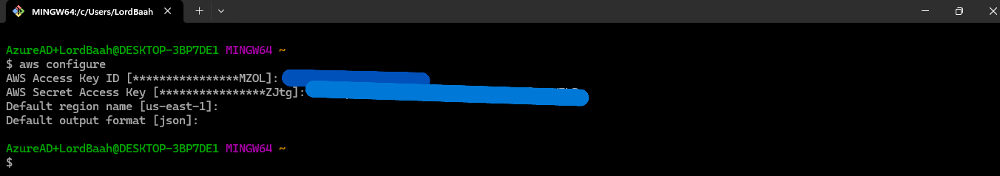

---

### 2. Terraform Apply in VS Code

_Provisioned infrastructure using Terraform in VS Code._

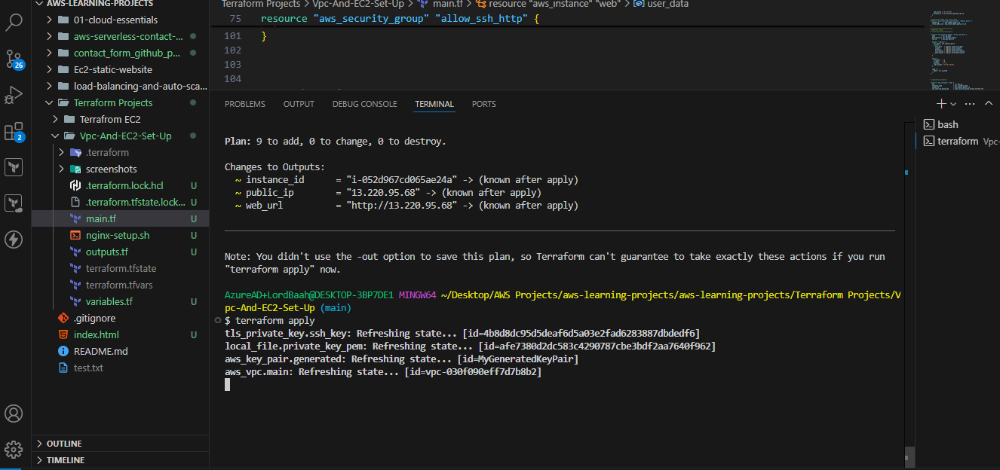

---

### 3. Custom VPC Created

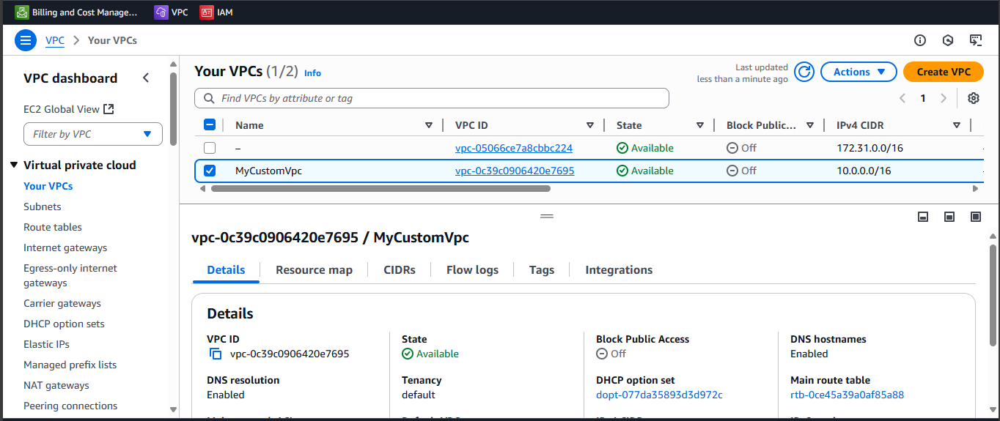

---

### 4. Custom Subnet Created

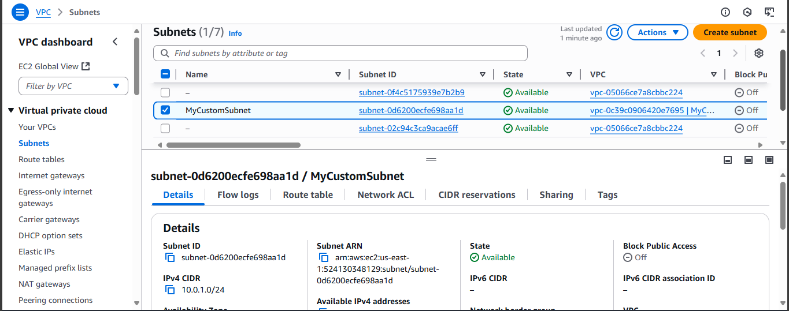

---

### 5. Internet Gateway Attached

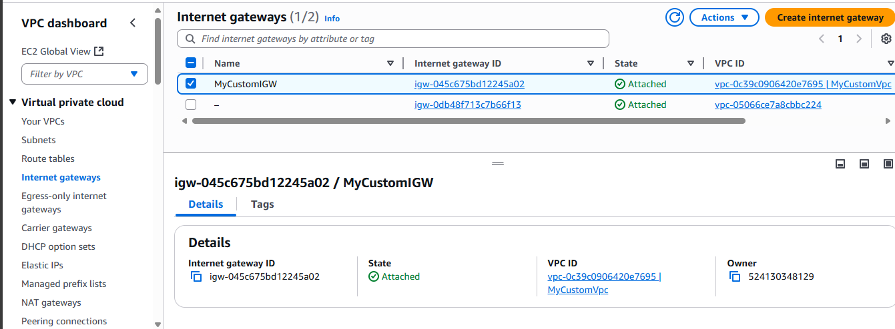

---

### 6. Route Table with Public Route

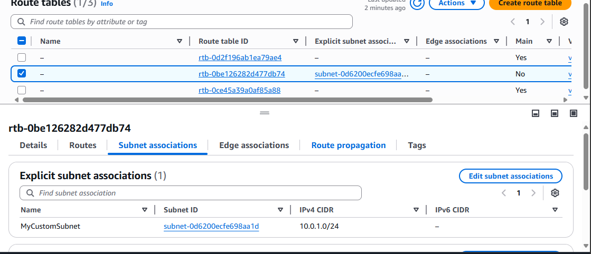

---

### Security Group Configured

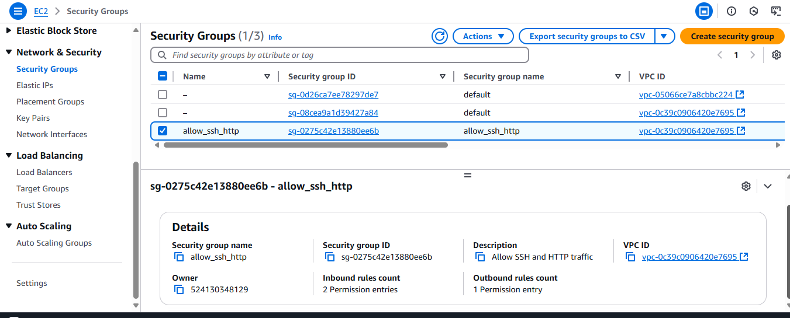

---

### 7. EC2 Instance Running

_Verified the EC2 instance is up and running._

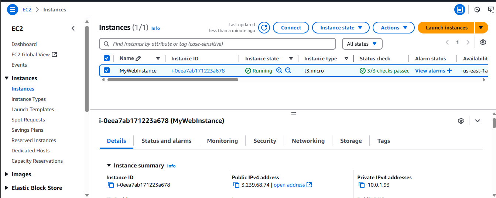

---

### 8. SSH into EC2 Instance

_Accessed the EC2 instance via SSH._

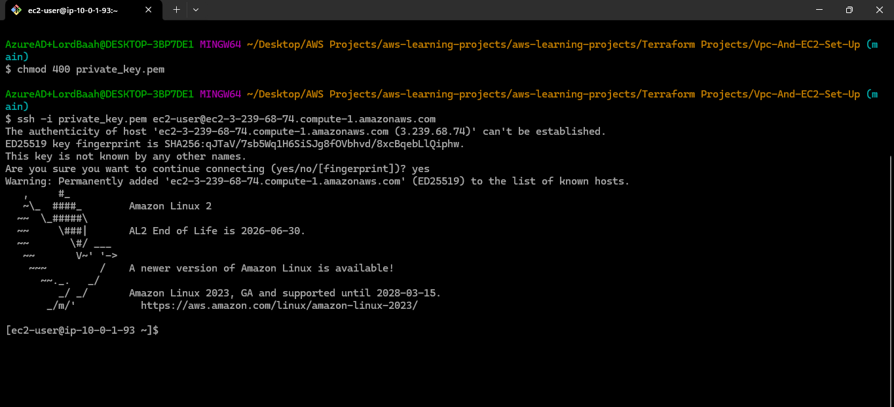

---

### 9. NGINX Website Running on EC2 Public IP

_Confirmed NGINX is serving the default page on the public IP._

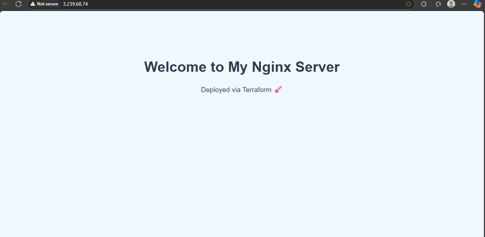

---

### 10. Terraform Code

_Terraform script used to define infrastructure._


---

### 11. Terraform Destroy Output

_Resources destroyed successfully via Terraform._

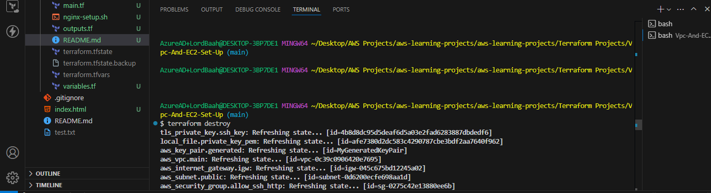  
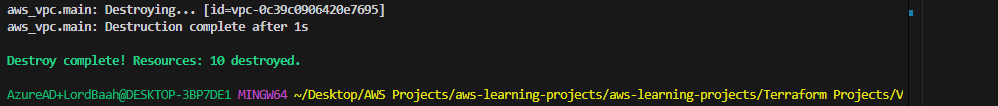

---

### 12. EC2 Instance Terminated

_Confirmed the EC2 instance is terminated post-destroy._

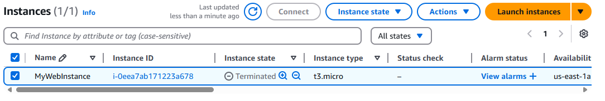
