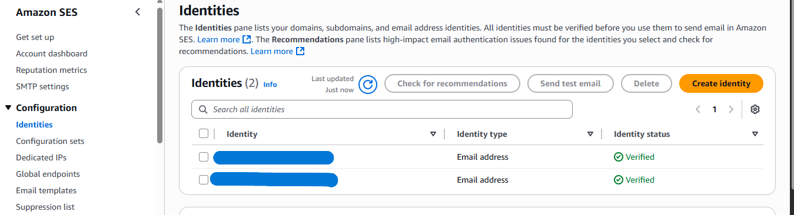
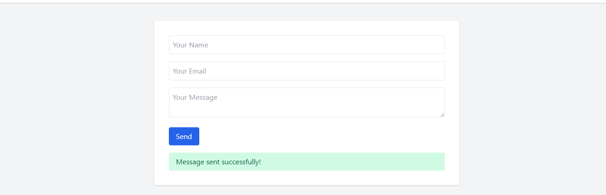

# AWS Serverless Contact Form

A complete guide to building and deploying a serverless contact form using AWS services (S3, Lambda, API Gateway, and SES).


## 📋 Table of Contents

- [Introduction](#introduction)
- [Prerequisites](#prerequisites)
- [Architecture Overview](#architecture-overview)
- [Step 1: Set Up Amazon SES](#step-1-set-up-amazon-ses)
- [Step 2: Create IAM Policies and Roles](#step-2-create-iam-policies-and-roles)
- [Step 3: Create Lambda Function](#step-3-create-lambda-function)
- [Step 4: Set Up API Gateway](#step-4-set-up-api-gateway)
- [Step 5: Host Frontend on S3](#step-5-host-frontend-on-s3)
- [Step 6: Testing](#step-6-testing)
- [Troubleshooting](#troubleshooting)
- [Repository Structure](#repository-structure)
- [References](#references)

## Introduction

This project demonstrates how to build a serverless contact form solution using AWS services. The contact form is hosted on Amazon S3 as a static website, and when a user submits the form, it triggers an API Gateway endpoint, which invokes a Lambda function to send an email via Amazon SES.

This solution is:

- **Cost-effective**: You only pay for what you use
- **Scalable**: Can handle varying loads automatically
- **Secure**: Uses AWS IAM for permissions
- **Maintenance-free**: No servers to manage

## Architecture Overview

Here's how the components work together:

1. User visits the contact form hosted on Amazon S3
2. User fills out and submits the form
3. Form submission sends a request to API Gateway
4. API Gateway triggers the Lambda function
5. Lambda function uses Amazon SES to send an email with the form data
6. Response is returned to the user


## Step 1: Set Up Amazon SES

Since our Lambda function will send emails using Amazon SES, we need to set this up first.

### Verify Email Addresses

When your AWS account is in SES sandbox mode (default for new accounts), you can only send emails to and from verified email addresses.

1. Navigate to the Amazon SES console
2. Select **Email Addresses** under Identity Management
3. Click **Verify a New Email Address**
4. Enter your sender email address and click **Verify This Email Address**
5. Repeat for your recipient email address




6. Check both email inboxes and click the verification links

> 📝 **Note**: To send emails to non-verified recipients, you need to request production access for SES. This is not covered in this guide.

## Step 2: Create IAM Policies and Roles

### Create IAM Policy for Lambda

1. Go to the IAM Console and click on **Policies** in the left sidebar
2. Click **Create policy**
3. Select the **JSON** tab
4. Paste the following policy:

```json
{
  "Version": "2012-10-17",
  "Statement": [
    {
      "Effect": "Allow",
      "Action": "ses:SendEmail",
      "Resource": "*"
    }
  ]
}
```

[link to json policy file](#)


5. Click **Next: Tags** (optional)
6. Click **Next: Review**
7. Name the policy (e.g., `LambdaSESSendEmailPolicy`) and provide a description
8. Click **Create policy**


### Create IAM Role for Lambda

1. In the IAM console, click on **Roles** in the left sidebar
2. Click **Create role**
3. Select **AWS service** as the trusted entity type
4. Select **Lambda** as the use case
5. Click **Next: Permissions**
6. Search for the policy you created earlier (`LambdaSESSendEmailPolicy`) and select it
7. Also search for and add the `AWSLambdaBasicExecutionRole` to allow Lambda to write logs
8. Click **Next: Tags** (optional)
9. Click **Next: Review**
10. Name the role (e.g., `ContactFormLambdaRole`) and provide a description
11. Click **Create role**


## Step 3: Create Lambda Function

### Create the Function

1. Go to the AWS Lambda console
2. Click **Create function**
3. Select **Author from scratch**
4. Set the following:
   - **Function name**: ContactFormHandler
   - **Runtime**: Node.js 22.x
   - **Architecture**: x86_64
   - **Permissions**: Use an existing role
   - **Existing role**: Select the role you created earlier (`ContactFormLambdaRole`)
5. Click **Create function**


### Add Function Code

1. In the function code editor, create a new file named `index.mjs` (since we're using ES modules)
2. Paste the following updated code:

link to code

> **Important**: Replace `YOUR_RECIPIENT_EMAIL` and `YOUR_SENDER_EMAIL` with your verified SES email addresses.

3. Click **Deploy** to save your function


### Test the Function

1. Click **Test** in the Lambda console
2. Create a new test event with the following JSON:

```json
{
  "body": "{\"name\":\"Test User\",\"email\":\"test@example.com\",\"message\":\"This is a test message.\"}"
}
```

3. Name the test event (e.g., `TestContactForm`) and click **Save**
4. Click **Test** to execute the function
5. If everything is configured correctly, you should receive a success message


## Step 4: Set Up API Gateway

### Create REST API

1. Go to the API Gateway console
2. Click **Create API**
3. Select **REST API** (not REST API Private)
4. Click **Build**
5. Choose **New API**
6. Set the API name to `ContactFormAPI` and select **Regional** for the Endpoint Type
7. Click **Create API**


### Create Resource and Method

1. Click **Actions** and select **Create Resource**
2. Set Resource Name to `contact`
3. Click **Create Resource**
4. With the `/contact` resource selected, click **Actions** and select **Create Method**
5. Select **POST** from the dropdown and click the checkmark
6. Configure the POST method:
   - **Integration type**: Lambda Function
   - **Lambda Proxy integration**: Check this box (this is critical for proper request handling)
   - **Lambda Function**: Select the region and enter the function name (`ContactFormHandler`)
7. Click **Save**
8. When prompted to give API Gateway permission to invoke your Lambda function, click **OK**


### Set Up CORS (Critical)

1. With the `/contact` resource selected, click **Actions** and select **Enable CORS**
2. Set the following:
   - **Access-Control-Allow-Origin**: `*` (or your specific website URL)
   - **Access-Control-Allow-Headers**: `Content-Type,X-Amz-Date,Authorization,X-Api-Key,X-Amz-Security-Token`
   - **Access-Control-Allow-Methods**: Leave the default (which should include OPTIONS, POST), you can check them if not selected
3. Click **Enable CORS and replace existing CORS headers**
4. Click **Yes, replace existing values** when prompted


### Deploy the API

1. Click **Actions** and select **Deploy API**
2. For Deployment stage, select **New Stage**
3. Set Stage name to `prod`
4. Click **Deploy**
5. Note the Invoke URL at the top of the page - you'll need this for your frontend


### Test the API Endpoints

Test the Endpoint:
Use Thunder Client, Postman, or curl to send a POST request to the API endpoint:

- Endpoint: `POST https://{api-id}.execute-api.us-east-1.amazonaws.com/prod/contact`
- Headers: `Content-Type: application/json`
- Body:

```json
{
  "name": "John Doe",
  "email": "john@example.com",
  "message": "Hello from the contact form!"
}
```


## Step 5: Host Frontend on S3

### Create S3 Bucket

1. Go to the S3 console
2. Click **Create bucket**
   - Enter a globally unique bucket name (e.g., `contact-form-yourdomain-com`)
   - Select the region closest to your users
   - Uncheck **Block all public access**
   - Acknowledge the warning
   - Keep the rest of the settings as default
   - Click **Create bucket**


### Enable Static Website Hosting

1. Click on your newly created bucket
2. Go to the **Properties** tab
   - Scroll down to **Static website hosting**
   - Click **Edit**
   - Select **Enable**
   - Set **Index document** to `index.html`
   - Set **Error document** to `error.html` (optional)
   - Click **Save changes**


### Create Bucket Policy

1. Go to the **Permissions** tab
2. Scroll down to **Bucket policy**
3. Click **Edit**
4. Paste the following policy (replace `YOUR-BUCKET-NAME` with your actual bucket name):

```json
{
  "Version": "2012-10-17",
  "Statement": [
    {
      "Sid": "PublicReadGetObject",
      "Effect": "Allow",
      "Principal": "*",
      "Action": "s3:GetObject",
      "Resource": "arn:aws:s3:::YOUR-BUCKET-NAME/*"
    }
  ]
}
```

5. Click **Save changes**


### Configure CORS for S3 Bucket

If your frontend and API are in different domains, you should also configure CORS for your S3 bucket:

1. In your S3 bucket, go to the **Permissions** tab
2. Scroll down to **Cross-origin resource sharing (CORS)**
3. Click **Edit**
4. Paste the following configuration:

```json
[
  {
    "AllowedHeaders": ["*"],
    "AllowedMethods": ["GET", "HEAD"],
    "AllowedOrigins": ["*"],
    "ExposeHeaders": []
  }
]
```

5. Click **Save changes**

### Create and Upload Frontend Files

Create the following file locally:

**index.html**
You can use the files provided in this repo

⚠️ **Important**: Replace `YOUR_API_GATEWAY_URL` with the Invoke URL you noted from API Gateway (without `/contact` at the end, as it's already included in the fetch URL).

### Upload Files to S3

1. In your S3 bucket, click **Upload**
2. Add the files you created (`index.html`)
3. Click **Upload**


### Get Website URL

1. Go to the **Properties** tab
2. Scroll down to **Static website hosting**
3. Note the **Bucket website endpoint** - this is your contact form's URL


## Step 6: Testing

1. Open your S3 website URL in a web browser
2. Fill out the contact form with test data
3. Submit the form
4. You should see a success message and receive an email at your verified recipient address





## ⚠️ Troubleshooting Common Issues

### ❌ CORS Errors

**Issue**: "Access has been blocked by CORS policy: No 'Access-Control-Allow-Origin' header is present..."

**Solution**:

1. Make sure CORS is enabled on your API Gateway resource
2. Ensure your Lambda function returns the proper CORS headers in all responses
3. Configure CORS on your S3 bucket if needed
4. Deploy your API after making CORS changes

### ❌ "Request body is missing" Error

**Issue**: Lambda function cannot access the request body.

**Solution**:

1. Ensure Lambda Proxy Integration is enabled in API Gateway
2. Check that your Lambda function properly parses `event.body`
3. Include detailed error logging in your Lambda function for troubleshooting

```javascript
// Add this to your Lambda to debug request issues
console.log('Received event:', JSON.stringify(event, null, 2));
```

### ❌ SES Access Denied Error

**Issue**: If SES throws an "Access Denied" error.

**Solution**:

1. Ensure both sender and recipient email addresses are verified in SES
2. Check that your Lambda IAM role has permissions to use SES
3. Verify your SES account is still in sandbox mode (likely) and restricted to verified emails only

### ❌ API Gateway 500 Errors

**Issue**: API Gateway returns 500 error responses.

**Solution**:

1. Check CloudWatch Logs for detailed error messages
2. Ensure the Lambda function is handling errors properly and returning formatted responses
3. Test the Lambda function directly in the Lambda console to isolate issues

### ❌ require is not defined in ES module scope

**Issue**: Node.js 22 does not support `require()` in ES module mode.

**Solution**: Use `import` instead of `require` for loading AWS SDK and other dependencies.

## 🔧 Final Notes

- **IAM Role Permissions**: Make sure the IAM role used by Lambda has both SES and CloudWatch Logs permissions.
- **SES in Sandbox**: If you're in the SES sandbox, you'll need to verify both sender and recipient emails.
- **Logging**: Always implement proper logging in your Lambda function to help with troubleshooting.
- **Testing**: Use the browser console (F12) to see detailed frontend errors and CloudWatch Logs for backend errors.

## References

- [Amazon S3 Static Website Hosting Documentation](https://docs.aws.amazon.com/AmazonS3/latest/dev/WebsiteHosting.html)
- [AWS Lambda Documentation](https://docs.aws.amazon.com/lambda/latest/dg/welcome.html)
- [Amazon API Gateway Documentation](https://docs.aws.amazon.com/apigateway/latest/developerguide/welcome.html)
- [Amazon SES Documentation](https://docs.aws.amazon.com/ses/latest/dg/Welcome.html)
- [AWS IAM Documentation](https://docs.aws.amazon.com/IAM/latest/UserGuide/introduction.html)
- [Understanding and Solving CORS Issues](https://aws.amazon.com/premiumsupport/knowledge-center/api-gateway-cors-errors/)
